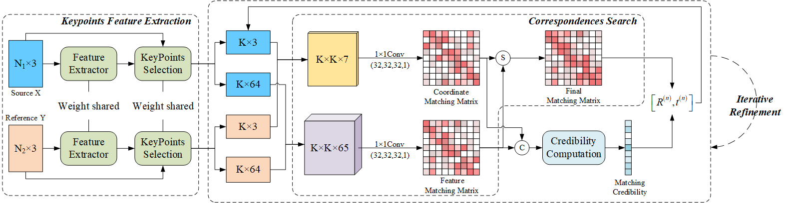
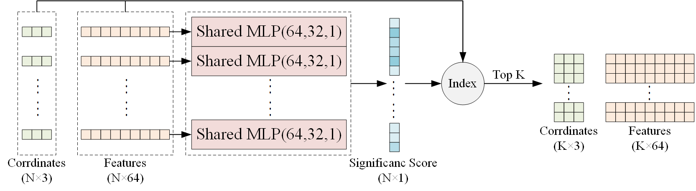
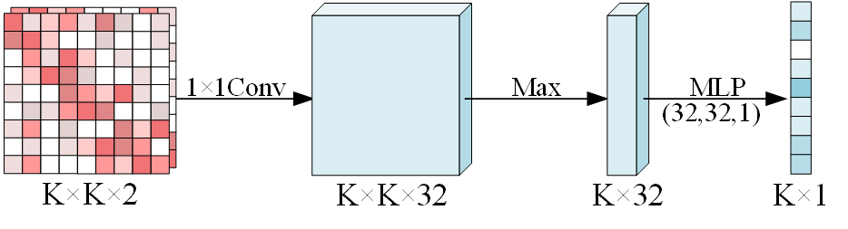

# Code for Paper "Multi-Features Guidance Network for partial-to-partial point cloud registration" (MFGNet)
This is the official code repository for "Multi-Features Guidance Network for partial-to-partial point cloud registration" [[arxiv](https://arxiv.org/abs/2011.12079)]. The code is largely adapted from https://github.com/jiahaowork/idam.







## Environment
python 3.7

torch 1.5.1 + cu101

Open3D 0.10.0.1

spicy 1.4.1

hyp5 2.10.0

tqdm 4.47.0

## Usage
The easiest way to run the code is using the following command
```
python main.py --exp_name exp
```
This command will run an experiment on the ModelNet40 dataset (automatically downloaded) with all the options set to default. You can see at the end of main.py a list of options that can be used to control hyperparameters of the model and experiment settings. The comments in the file should be enough to understand them.

or you can use our pretrained weight for test
```
python test.py
```

## Citation
If you want to use it in your work, please cite it as

	@article{wang2020multi,
            title={Multi-Features Guidance Network for partial-to-partial point cloud registration},
            author={Wang, Hongyuan and Liu, Xiang and Kang, Wen and Yan, Zhiqiang and Wang, Bingwen and Ning, Qianhao},
            journal={arXiv preprint arXiv:2011.12079},
            year={2020}
            }
